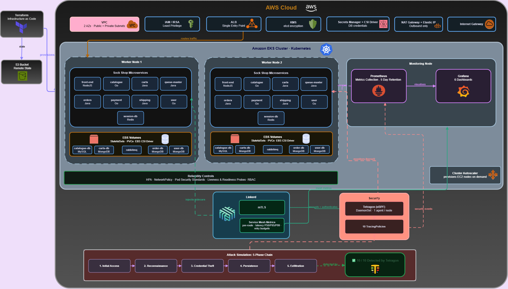
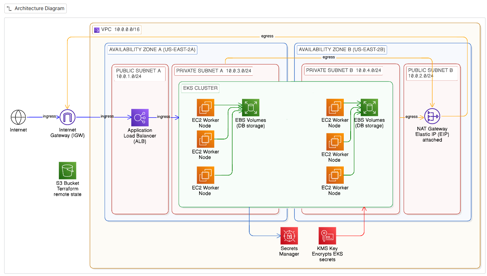
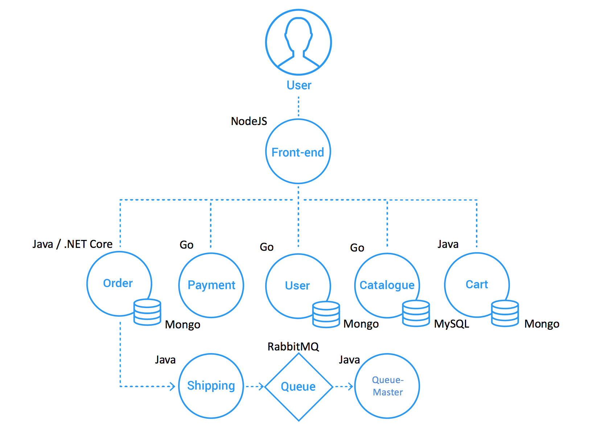

<div align="center">

# SecureSight

**Security and Site Reliability Engineering of a Cloud-Native Microservices Application on AWS EKS**

[](https://kubernetes.io) [](https://aws.amazon.com/eks/) [](https://www.terraform.io) [](https://linkerd.io)  [](https://tetragon.io) [](https://prometheus.io) [](https://grafana.com)

</div>

---

SecureSight is a production-grade reference implementation of SRE and cloud-native security engineering applied to a polyglot microservices application. 
The application is Sock Shop, an open-source microservices demo written in Go, Java, .NET, and NodeJS. It was deployed on a fully Terraform-provisioned EKS cluster and layered four engineering concerns on top: hardened cloud infrastructure provisioned entirely through Terraform, Kubernetes reliability controls, a full observability stack, and kernel-level runtime security detection via eBPF.

The project demonstrates that reliability engineering, observability, and runtime security are not independent concerns, they compose into a single coherent architecture where each layer reinforces the others.


## Table of Contents
 
- [Features](#features)
- [Stack](#stack)
- [Repository Structure](#repository-structure)
- [Cloud Infrastructure](#cloud-infrastructure)
- [Kubernetes Reliability](#kubernetes-reliability)
- [Observability](#observability)
- [Security](#security)
  - [Network Security](#network-security)
  - [Pod Security Standards](#pod-security-standards)
  - [Secrets Management](#secrets-management)
  - [mTLS with Linkerd](#mtls-with-linkerd)
  - [Runtime Security: Tetragon](#runtime-security-tetragon)
- [Getting Started](#getting-started)
- [Attack Simulation](#attack-simulation)
## Features
 
**Infrastructure**
- Full AWS infrastructure provisioned via modular Terraform (zero manual console clicks)
- Multi-AZ VPC with public/private subnet separation; EKS worker nodes in private subnets only
- Remote Terraform state in S3 with versioning, encryption, and native state locking
- KMS encryption for all Kubernetes secrets at rest in etcd
- AWS Secrets Manager integration via Secrets Store CSI Driver (no credentials in manifests)
- Dedicated IAM roles per component; workload-level AWS access via IRSA

**Reliability**
- Minimum 2 replicas for every stateless Deployment
- StatefulSets with EBS-backed PersistentVolumeClaims for all databases (MongoDB, MySQL, RabbitMQ)
- Per-container resource requests and limits on every workload
- Liveness and readiness probes on every service
- Horizontal Pod Autoscaler (HPA) on all stateless services (min 2, max 6 replicas)
- Cluster Autoscaler with lifecycle ignore for externally-managed `desired_size`
- Dedicated monitoring node isolated via taints/tolerations; the observability stack never competes with app workloads

**Observability**
- Prometheus with 5-day retention on 20 GB EBS-backed persistent storage
- 6 purpose-built Grafana dashboards covering workload resources, pod health, HPA scaling, Linkerd service mesh metrics, mTLS coverage, and Tetragon security events
- Automatic per-route traffic metrics, latency percentiles (P50/P95/P99), and request rates from Linkerd sidecars (zero application code changes required)
- Per-route HTTP retry budgets and timeouts defined as Linkerd `HTTPRoute` resources

**Security**
- Default-deny NetworkPolicy on every service; explicit allow-list per service pair
- Linkerd mTLS at 100% coverage; all inter-service traffic is encrypted and identity-verified
- Tetragon eBPF runtime security with 10 custom `TracingPolicy` resources covering the full attack surface
- Pod Security Standards: non-root execution, read-only root filesystem, all Linux capabilities dropped
- Namespace-scoped RBAC: `dev` group scoped to `sock-shop`; `sre` group scoped to `monitoring`, `linkerd`, `security`
## Stack
 
| Layer | Technology |
|---|---|
| Cloud Provider | AWS (EKS, VPC, EBS, KMS, Secrets Manager, IAM, ALB) |
| Infrastructure as Code | Terraform |
| Container Orchestration | Kubernetes 1.33 on Amazon EKS |
| Application | Sock Shop: [ocp-power-demos/sock-shop-demo](https://github.com/ocp-power-demos/sock-shop-demo) |
| Service Mesh | Linkerd |
| Metrics Collection | Prometheus (kube-prometheus-stack) |
| Visualization | Grafana |
| Runtime Security | Tetragon (eBPF) |
| Secret Store | AWS Secrets Manager + Secrets Store CSI Driver |
 
## Repository Structure
 
```
SecureSight/
├── architecture/
│   ├── project_architecture.png      # Full system architecture diagram
│   ├── Architecture.png              # Sock Shop inter-service communication
│   └── aws_architecture.png  # AWS infrastructure diagram
│
├── environments/
│   └── dev/
│       ├── main.tf                # Module composition for dev environment
│       ├── backend.tf             # S3 remote state with versioning + encryption
│       ├── provider.tf
│       └── variables.tf
│
├── terraform/
│   └── modules/
│       ├── vpc/                   # VPC with 10.0.0.0/16 CIDR
│       ├── subnets/               # 2 public + 2 private subnets across 2 AZs
│       ├── igw/                   # Internet Gateway
│       ├── nat/                   # NAT Gateway with Elastic IP
│       ├── routes/                # Route tables (public → IGW, private → NAT)
│       ├── eks/                   # EKS cluster + KMS encryption config
│       ├── nodes/                 # App node group (3 nodes) + monitoring node group (1 node, tainted)
│       ├── iam/                   # IAM roles: EKS control plane, node group, IRSA bindings
│       ├── lb/                    # AWS Load Balancer Controller + ALB provisioning
│       ├── ebs/                   # EBS CSI driver for persistent storage
│       ├── csi-driver/            # Secrets Store CSI Driver
│       ├── secrets-manager/       # AWS Secrets Manager secrets (one module per DB)
│       └── eip/                   # Elastic IP for NAT Gateway
│
├── manifests/
│   └── base/
│       ├── microservices/         # One directory per service: Deployment, HPA, NetworkPolicy, Service
│       │   ├── carts/
│       │   ├── carts-db/          # StatefulSet + EBS StorageClass + NetworkPolicy
│       │   ├── catalogue/
│       │   ├── catalogue-db/      # SecretProviderClass for CSI secret injection
│       │   ├── frontend/          # Deployment + Ingress → ALB
│       │   ├── orders/
│       │   ├── orders-db/
│       │   ├── payment/
│       │   ├── queue-master/
│       │   ├── rabbitmq/
│       │   ├── session-db/
│       │   ├── shipping/
│       │   └── user/
│       ├── linkerd/
│       │   └── routes/            # HTTPRoute per service: retry budgets + per-method timeouts
│       ├── monitoring/
│       │   ├── grafana-dashboards/      # 6 pre-built dashboard JSONs
│       │   ├── linkerd-monitoring/      # Prometheus federation for Linkerd metrics
│       │   └── prometheus-grafana-values.yaml  # Helm values: node pinning, storage, retention
│       ├── cluster-autoscaler/
│       └── security/
│           ├── rbac/              # dev-rbac.yaml + sre-rbac.yaml
│           └── kustomization.yaml
│
└── tetragon/
    ├── policies/                  # 10 TracingPolicy CRDs
    ├── tests/                     # 10 individual test scripts (01-*.sh … 10-*.sh)
    ├── scenario-attack.sh         # Full 5-phase attack simulation
    └── tetragon-test.sh           # Test runner
```
 
## Cloud Infrastructure
 
The entire AWS infrastructure is provisioned by Terraform. No resource is created manually.
 
> The diagram below shows the full system architecture. For clarity, only one Availability Zone is represented; the actual deployment spans two AZs (`us-east-2a` and `us-east-2b`) with worker nodes and subnets duplicated across both.
 

 
The AWS infrastructure diagram below shows the network layout in detail across both AZs.
 

 
**Network architecture:**
- VPC `10.0.0.0/16` across `us-east-2a` and `us-east-2b`
- Two public subnets (ALB and NAT Gateway only); no worker nodes here
- Two private subnets `10.0.3.0/24` and `10.0.4.0/24`: all EKS worker nodes, no inbound internet exposure
- NAT Gateway with Elastic IP handles asymmetric routing: nodes initiate outbound, are never inbound-addressable
**EKS cluster:**
- Kubernetes 1.33 with KMS envelope encryption on all `secrets` resources in etcd
- Private endpoint with public access retained for `kubectl` access; nodes in private subnets
- EBS CSI Driver and Secrets Store CSI Driver installed as managed add-ons
**Remote state:**
```hcl
terraform {
  backend "s3" {
    bucket       = "s3-bucket-securesight"
    key          = "terraform.tfstate"
    region       = "us-east-2"
    encrypt      = true
    use_lockfile = true   # native S3 state locking
  }
}
```
 
The S3 bucket is itself provisioned by Terraform with versioning and AES256 server-side encryption, with all public access blocked.
 
**Node groups:**
 
| Node Group | Count | Purpose | Taint |
|---|---|---|---|
| `securesight-dev-node` | 3 (autoscaled) | Application workloads | — |
| `monitoring-nodes` | 1 (min 1, max 2) | Prometheus + Grafana | `role=monitoring-nodes:NoSchedule` |
 
The monitoring node taint prevents any application pod from landing on it. Prometheus and Grafana use a matching `toleration` + `nodeSelector` to ensure they only schedule there.
 
## Kubernetes Reliability
 
The application is [Sock Shop](https://github.com/ocp-power-demos/sock-shop-demo), a polyglot microservices demo composed of 13 services. The cluster is organized into six namespaces:
 
| Namespace | Contents | Isolation |
|---|---|---|
| `sock-shop` | All 13 application microservices + databases | NetworkPolicies, RBAC, Pod Security Standards |
| `monitoring` | Prometheus, Grafana | Dedicated tainted node, physically isolated from app nodes |
| `linkerd` | Service mesh control plane | Injects proxies into `sock-shop` at admission time |
| `security` | Tetragon DaemonSet | One agent per node; hooks into the Linux kernel |
| `kube-system` | Cluster Autoscaler, EBS CSI Driver, AWS Load Balancer Controller | Cluster-level components |
 
**Stateless services** (Deployment + HPA):
 
| Service | Language | Role |
|---|---|---|
| `front-end` | NodeJS | Web UI, only service exposed externally via Ingress |
| `catalogue` | Go | Product catalogue API |
| `carts` | Java | Shopping cart management |
| `orders` | Java / .NET | Order placement and management |
| `payment` | Go | Payment processing |
| `shipping` | Java | Order shipping logic |
| `queue-master` | Java | Processes shipping jobs from RabbitMQ |
| `user` | Go | User accounts and authentication |
| `session-db` | Redis | Session storage, stateless (no PVC) |
 
**Stateful services** (StatefulSet + EBS-backed PVC):
 
| Service | Backend | Storage |
|---|---|---|
| `carts-db` | MongoDB | 1 Gi EBS |
| `catalogue-db` | MySQL | 1 Gi EBS |
| `orders-db` | MongoDB | 1 Gi EBS |
| `user-db` | MongoDB | 1 Gi EBS |
| `rabbitmq` | RabbitMQ | 1 Gi EBS |
 

 
**Replica redundancy:** Every Deployment runs `replicas: 2` at minimum. Single-replica deployments create single points of failure during pod crashes, node failures, and rolling updates.
 
**StatefulSets with persistent storage:** All databases use StatefulSets with EBS-backed PersistentVolumeClaims. EBS volumes detach from a failed node and reattach to the replacement; data survives pod rescheduling.
 
```yaml
volumeClaimTemplates:
  - metadata:
      name: carts-db-data
    spec:
      storageClassName: ebs-sc
      accessModes: ["ReadWriteOnce"]
      resources:
        requests:
          storage: 1Gi
```
 
**Resource requests and limits:** Every container defines both. Requests drive scheduling decisions; limits prevent a single misbehaving container from starving every other pod on the node.
 
```yaml
resources:
  requests:
    cpu: 100m
    memory: 256Mi
  limits:
    cpu: 200m
    memory: 512Mi
```
 
**Horizontal Pod Autoscaling:** HPA on every stateless service, targeting 80% CPU utilization:
 
```yaml
minReplicas: 2
maxReplicas: 6
targetCPUUtilizationPercentage: 80
```
 
**Cluster Autoscaler:** Provisions additional EC2 nodes when pods cannot be scheduled and removes underutilized nodes when load drops. The node group uses `lifecycle.ignore_changes` on `desired_size` so Terraform does not fight the autoscaler.
 
**Health probes:** Liveness probes restart deadlocked containers. Readiness probes gate traffic; pods initializing or waiting on a database dependency are removed from service endpoints and receive no traffic until they pass.
 
**Per-route retry budgets (Linkerd):** HTTP retries are defined per service and per HTTP method. Safe idempotent reads (GET) get automatic retries on 5xx or connection reset; unsafe writes (POST, DELETE) do not.
 
```yaml
annotations:
  retry.linkerd.io/http: "5xx,reset"
  retry.linkerd.io/limit: "2"
  retry.linkerd.io/timeout: "200ms"
```
 
## Observability
 
The observability stack runs on a dedicated node isolated from application workloads. Metrics are never pushed; Prometheus scrapes on a pull model.
 
**Prometheus** collects from three source categories:
- Kubernetes system components (node CPU/memory, scheduling events, container resource consumption)
- Application services (request rates, error counts, response times)
- Linkerd sidecar proxies (per-service and per-route golden signals (zero application instrumentation required))
**Grafana dashboards** (all version-controlled as JSON in `manifests/base/monitoring/grafana-dashboards/`):
 
| Dashboard | What it shows |
|---|---|
| Kubernetes Workload | CPU/memory per pod (absolute + % of limit), restart count, readiness ratio, pending pods |
| Linkerd Sock Shop | Latency P50/P95/P99, inbound RPS, TCP connections and throughput per service |
| mTLS Coverage | mTLS percentage per service, confirms 100% encryption across the mesh |
| HPA Testing | Replica counts and scaling events |
| CPU & Memory | Cluster-wide resource usage |
| Tetragon | Runtime security events from kernel-level eBPF hooks |
 
**Linkerd metrics federation:** Prometheus in the `monitoring` namespace federates from Linkerd's internal Prometheus to collect mesh-layer metrics. A dedicated `PrometheusAuthorizationPolicy` permits this cross-namespace scrape.
 
**Prometheus storage:** 5-day retention on a 20 GB EBS-backed PVC, pinned to the monitoring node.
 
## Security
 
The security model is defense-in-depth across five independent layers, each effective even if another is bypassed.
 
### Network Security
 
All inter-pod communication follows a default-deny model. No pod can send or receive traffic unless an explicit `NetworkPolicy` permits that specific path.
 
```yaml
# Example: carts, only front-end and orders may connect
spec:
  podSelector:
    matchLabels:
      name: carts
  policyTypes:
  - Ingress
  ingress:
  - from:
    - podSelector:
        matchLabels:
          name: front-end
    - podSelector:
        matchLabels:
          name: orders
    ports:
    - protocol: TCP
      port: 80
```
 
All 13 services and all databases have their own NetworkPolicy. External traffic enters exclusively through a centralized ALB; no service has a direct external endpoint.
 
### Pod Security Standards
 
Every application container runs with:
- `runAsNonRoot: true` + explicit non-root `runAsUser`
- `readOnlyRootFilesystem: true`: attackers cannot write files or install tools inside a container
- All Linux capabilities dropped; only `NET_BIND_SERVICE` re-added where required
- `allowPrivilegeEscalation: false`
- `/tmp` mounted as in-memory `emptyDir` where write access is needed
```yaml
securityContext:
  runAsNonRoot: true
  runAsUser: 10001
  capabilities:
    drop: [all]
    add: [NET_BIND_SERVICE]
  readOnlyRootFilesystem: true
```
 
### Secrets Management
 
Database credentials are stored in AWS Secrets Manager, never in Kubernetes manifests, environment variables, or ConfigMaps. The Secrets Store CSI Driver retrieves secrets at pod startup and mounts them as in-memory volumes.
 
```yaml
# SecretProviderClass for catalogue-db
spec:
  provider: aws
  parameters:
    objects: |
      - objectName: "securesight-dev-catalogue-db-secret"
        objectType: "secretsmanager"
        objectAlias: password
    usePodIdentity: "true"
```
 
### mTLS with Linkerd
 
Linkerd automatically establishes mutual TLS between all meshed pods. Every inter-service connection is encrypted in transit and both endpoints are cryptographically authenticated using Linkerd-issued certificates that rotate automatically.
 
Proxy injection is enabled at the namespace level. Every pod in `sock-shop` runs `2/2` containers: the application container and the Linkerd proxy sidecar. No application code changes are required.
 
mTLS coverage is tracked per service in Grafana and maintained at 100% across all services.
 
### Runtime Security: Tetragon
 
Declarative controls (NetworkPolicies, RBAC, Pod Security Standards) define what workloads are *allowed* to do but have no visibility into what they *actually do* at runtime. Tetragon closes this gap by running eBPF programs inside the Linux kernel itself, monitoring system calls, file operations, network events, and process execution at a layer that cannot be evaded from inside a container.
 
Tetragon is deployed as a DaemonSet in the `security` namespace, one agent per node, monitoring all pods on that node continuously.
 
**10 custom `TracingPolicy` resources:**
 
| Policy | Kernel Hook | What it detects |
|---|---|---|
| `detect-shell` | `sys_execve` | Shell spawn inside a container (`/bin/bash`, `/bin/sh`, `/bin/dash`, `/bin/zsh`) |
| `detect-tools` | `sys_execve` | Attacker toolkit execution (`curl`, `wget`, `nc`, `nmap`, `python3`) |
| `detect-cred-access` | `fd_install` | Reads to `/etc/shadow`, `/root/.ssh/`, `/.aws/credentials`, `/proc/1/environ` |
| `detect-k8s-token` | `fd_install` | Access to `/var/run/secrets/kubernetes.io/serviceaccount/token` |
| `detect-external-connections` | `tcp_connect` | Outbound TCP to any IP outside RFC 1918 ranges |
| `detect-dns-exfiltration` | `udp_sendmsg` | UDP traffic to port 53 (DNS tunnelling) |
| `detect-port-bind` | `sys_bind` | Socket binding on backdoor ports (4444, 1337, 9999) |
| `detect-deleted-binary-exec` | `security_bprm_check` | Execution of a binary deleted from disk while running in memory (fileless malware) |
| `detect-privilege-escalation` | `__sys_setresuid` | Any `setresuid` call with `euid=0` |
| `detect-namespace-escape` | `sys_unshare` | `unshare(CLONE_NEWUSER)`, container escape via user-namespace creation |
 
**Validation: 10/10 passed, 0 failures.**
 
The `detect-deleted-binary-exec` policy deserves a note. Fileless malware copies a binary to `/tmp`, executes it, then deletes it from disk; the process keeps running in memory with no file on disk. File-integrity monitoring tools miss this entirely. Tetragon hooks at `security_bprm_check` inside the kernel's binary loader, so the event fires before the binary's first instruction runs, regardless of whether the file still exists. The path in the event ends with `(deleted)`, the kernel's own marker.
 
## Getting Started
 
### Prerequisites
 
- AWS CLI configured with appropriate credentials
- `terraform` ≥ 1.6
- `kubectl`
- `helm` ≥ 3.0
- `linkerd` CLI
- `tetra` CLI (optional, for reading Tetragon events)
### 1. Provision Infrastructure
 
```bash
cd environments/dev
terraform init
terraform plan
terraform apply
```
 
This provisions the VPC, subnets, IGW, NAT Gateway, EKS cluster (with KMS encryption), node groups, IAM roles, load balancer controller, EBS CSI driver, Secrets Store CSI Driver, and all AWS Secrets Manager secrets.
 
### 2. Configure kubectl
 
```bash
aws eks update-kubeconfig \
  --region us-east-2 \
  --name securesight-dev-eks
```
 
### 3. Deploy Application Workloads
 
```bash
kubectl apply -k manifests/base/microservices/
 
# Verify
kubectl get pods -n sock-shop
```
 
### 4. Install Linkerd
 
```bash
linkerd install --crds | kubectl apply -f -
linkerd install | kubectl apply -f -
linkerd check
 
# Enable sidecar injection for the app namespace
kubectl annotate namespace sock-shop linkerd.io/inject=enabled
 
# Apply per-route HTTPRoute resources
kubectl apply -k manifests/base/linkerd/
```
 
### 5. Deploy Observability Stack
 
```bash
helm repo add prometheus-community https://prometheus-community.github.io/helm-charts
helm repo update
helm upgrade --install kube-prometheus-stack prometheus-community/kube-prometheus-stack \
  -n monitoring --create-namespace \
  -f manifests/base/monitoring/prometheus-grafana-values.yaml
 
# Apply Linkerd metrics federation
kubectl apply -f manifests/base/monitoring/linkerd-monitoring/
 
# Verify
kubectl get pods -n monitoring
```
 
### 6. Deploy Cluster Autoscaler
 
```bash
helm repo add autoscaler https://kubernetes.github.io/autoscaler
helm repo update
helm upgrade --install cluster-autoscaler autoscaler/cluster-autoscaler \
  --namespace kube-system \
  --values manifests/base/cluster-autoscaler/cluster-autoscaler-values.yaml
```
 
### 7. Deploy Tetragon and Security Policies
 
```bash
# Apply all 10 TracingPolicies
kubectl apply -f tetragon/policies/
 
# Apply RBAC
kubectl apply -f manifests/base/security/rbac/
 
# Verify
kubectl get pods -n kube-system -l app.kubernetes.io/name=tetragon
kubectl get tracingpolicies
```
 
### 8. Access the Application
 
```bash
# Get the ALB DNS name
kubectl get ingress -n sock-shop
```
 
## Attack Simulation
 
`tetragon/scenario-attack.sh` deploys an attacker pod with a full toolkit (curl, wget, nmap, python3, netcat) and runs a complete 5-phase attack chain against the live cluster, streaming Tetragon detection events in real time.
 
```bash
cd tetragon
chmod +x scenario-attack.sh
./scenario-attack.sh
```
 
| Phase | Steps | Policies triggered |
|---|---|---|
| Initial Access | Shell spawn, curl/wget to C2 server | `detect-shell`, `detect-tools` |
| Reconnaissance | Read `/proc/1/environ`, nmap internal network, read `/etc/shadow` | `detect-cred-access`, `detect-tools` |
| Credential Theft | Read K8s service account token, call API server, access `/.aws/credentials` | `detect-k8s-token`, `detect-cred-access`, `detect-external-connections` |
| Persistence | `setresuid(0,0,0)` privesc, bind port 4444, container escape via `unshare`, fileless malware | `detect-privilege-escalation`, `detect-port-bind`, `detect-namespace-escape`, `detect-deleted-binary-exec` |
| Exfiltration | TCP to public C2 IP, DNS tunnelling with base64 subdomains | `detect-external-connections`, `detect-dns-exfiltration` |
 
Individual tests can be run independently:
 
```bash
./tests/01-shell-spawn.sh
./tests/08-deleted-binary.sh
 
# Or run all 10
./tetragon-test.sh
```
 
Stream Tetragon events live:
 
```bash
kubectl logs -n security -l app.kubernetes.io/name=tetragon \
  -c export-stdout -f \
  | tetra getevents -o compact --namespace sock-shop \
  | grep -v -E 'linkerd|json-exporter'
```
 
## Authors
 
Nada Bargougui · Mariem Logtari · Yasmine Elhakem · Amal Sboui
